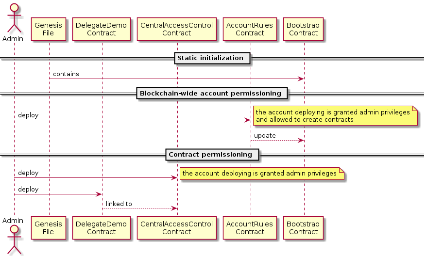
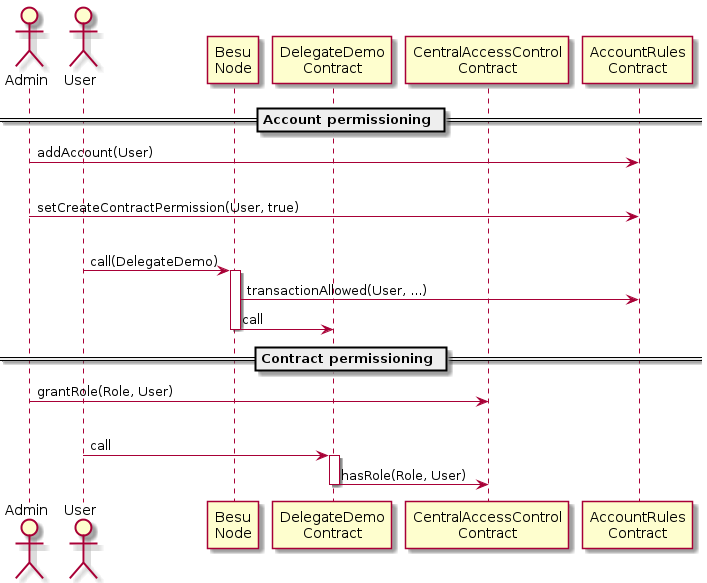

A demo for account and contract permissioning with besu
=======================================================

This runs a private ethereum network of three besu nodes, one of which is a validator.
Besu is running using the flexible permissioning extension that allows to control account behavior using a smart contract.
Two trivial smart contracts are included to demonstrate how OpenZeppelin access control can be used either on a per-contract basis (`DirectContract`) or using a central authority for all contracts (`DelegateContract`).

Running the demo
----------------

Start the nodes via

    docker-compose up -d

If you want to see the besu node logs, omit the `-d` and run this command in a separate terminal.

Then compile and deploy all contracts to your network using

    ./deploy.sh

and follow the instructions given there.

Cleaning up
-----------

Stop the besu network via

    docker-compose down

This retains the state of the blockchain. To erase all blockchain data and start from scratch run

    rm -r docker-data/node*/{DATABASE_METADATA.json,caches,database}

Contract deployment sequence
----------------------------

Permissioning setup happens in three phases:

1. A bootstrap contract is included in the [genesis file](/docker-config/genesis.json).
   Besu nodes are started with `--permissions-accounts-contract-enabled --permissions-accounts-contract-address=0x0000000000000000000000000000000000008888` to activate account permissioning using this particular contract.
   The bootstrap contract allows all blockchain interactions and has the sole purpose of being a placeholder before being updated by the actual account permissioning contract.
2. The [AccountRules](/permissioning-smart-contract/contracts/AccountRules.sol) contract is deployed by an arbitrary account.
   By deploying, this account becomes the admin account for entire blockchain.
3. The [CentralAccessControl](/contracts/CentralAccessControl.sol) contract is deployed.
   Again, the account deploying it becomes the administrator of that contract.

All subsequently deployed contracts are derived from the [DelegatedAccessControl](/contracts/DelegatedAccessControl.sol) contract and linked to the `CentralAccessControl` instance on deployment.



Permissiong control flow
------------------------

Every blockchain interaction is checked on two levels:
* Transactions are checked by looking up whether the sender is permitted in the `AccountRules` contract.
* Calls in a transaction are checked by looking up whether the caller has the required role in the `CentralAccessControl` contract.



Using the CLI
-------------

A scaffolded CLI is provided that makes web3js calls to the permissioning contracts. Two options are provided for accounts permissioning and contract permissioning under the `/api` folder.

Once the nodes are configured and contracts are deployed, you can start experimenting with the api - run `node api/accountRulesCLI.js -h` to get a full list of all available commands.

For example you can use
``` 
node api/accountRulesCLI.js accountPermitted D1cf9D73a91DE6630c2bb068Ba5fDdF9F0DEac0
```

To send a call to the accounPermitted method from the AccountRules contract.
